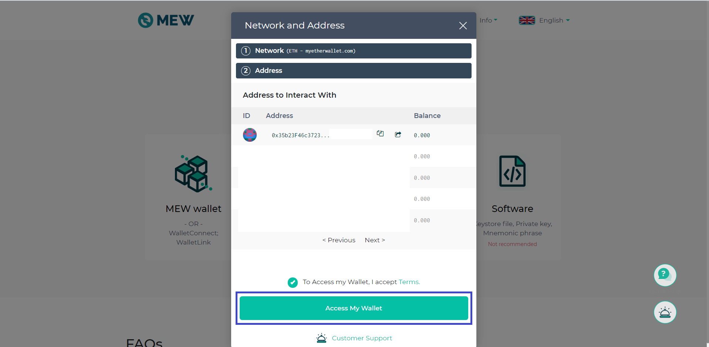
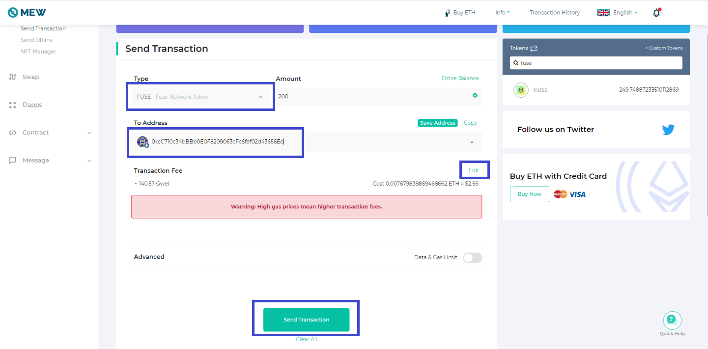

# Ledger tutorial for UBIT

This tutorial was made using Ledger Nano S with firmware version 1.6.1 and Ethereum app version on Ledger Nano S was 1.3.7.

**Step 1:** Please make sure that you have installed the latest version of Ethereum app on your Ledger as shown below.

**Step 2:** Go to [www.myetherwallet.com](http://www.myetherwallet.com/) and click on **“Access my Wallet”**.

**Step 3:** Click on “**Hardware**” then select “**Ledger**” then click “**Continue**” and then click on **“Next”** as shown below.

**Step 4:** MyEtherWallet will load all the Ethereum wallets present on your Ledger device. Please select the Wallet you would like to Send/Receive UBIT tokens, accept the terms and conditions and click on **“Access my Wallet”.**

**Step 5:** Now that you have logged in to your address in Ledger through MyEtherWallet, you can see your Ethereum address, balance, etc.

**Step 6: UBIT** is already present in the default list of tokens on MEW. You just have to search **UBIT** on the right hand side \(as shown below\) to view your **UBIT** balance on that particular Ethereum address.

Now let’s learn how to Send/Receive **UBIT** on MEW.

**To receive UBIT:** Once completing Steps 1-6, Click **“Copy address”** button just below your “Address” \(Public key\) as highlighted below. This is the address to which you can receive UBIT and can be viewed on your MEW once confirmed on-chain.

**To send UBIT:** Click on **“Send Transaction”** and when you have **UBIT** in your wallet you should be able to select **“UBIT”** from the **“Type”** drop down. Enter the **“Amount”** you want to send as well as the **“To Address”** to which you want to transfer **UBIT**. You can also click **“Edit”** if you want to change gas prices. Once you have entered all the details click on **“Send Transaction”.** Now you should get a popup on your ledger device to approve the transaction. After approving physically on the Ledger device the final confirmation screen will appear showing all the details

Double check all the details, click on **“Confirm and Send”** and wait for your transaction to be confirmed on-chain.

We hope this tutorial helped you to learn how to connect your Ledger to MEW and send/receive **UBIT tokens**. Until next time friends!

